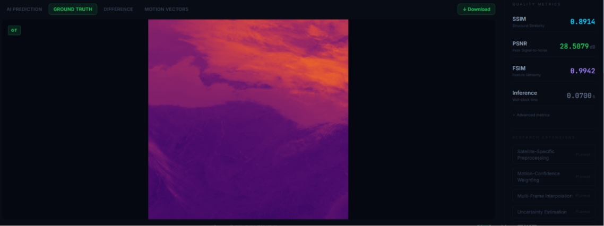
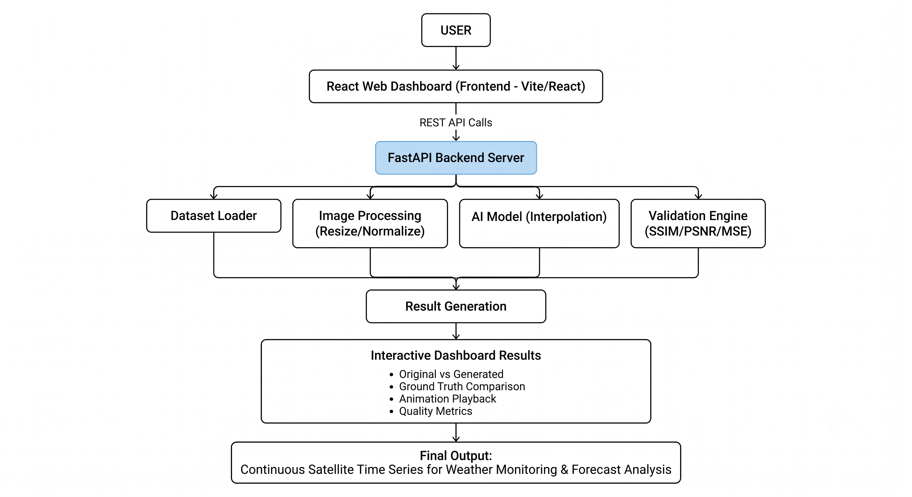
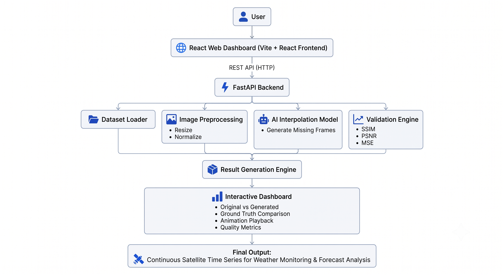
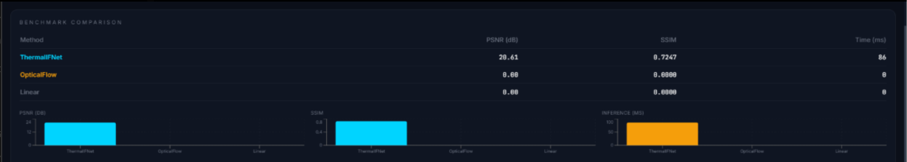
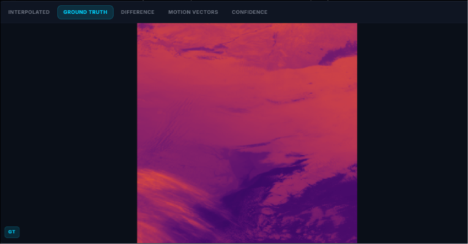
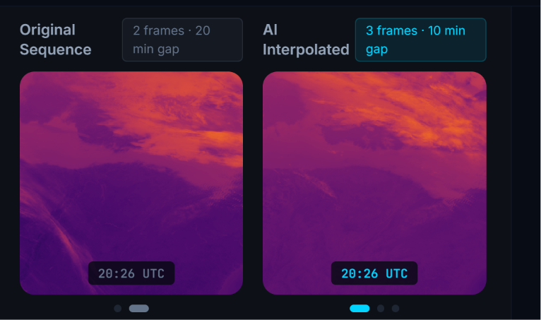
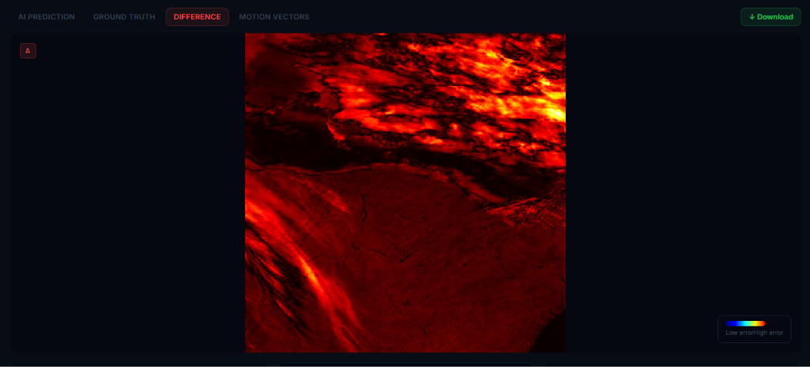

<!-- ========================================================= -->
<!--                        PROJECT BANNER                     -->
<!-- ========================================================= -->

<p align="center">
  
</p>

<h1 align="center">
🛰️ AI-Powered Satellite Frame Interpolation
</h1>

<h3 align="center">
Bridging Missing Satellite Observations using Deep Learning with Scientific Validation
</h3>

<p align="center">


</p>

---

# 🎯 Problem Statement

Satellite images are captured at fixed time intervals, creating gaps between consecutive observations. These gaps make it difficult to continuously monitor rapidly changing events such as cyclones, thunderstorms, floods, wildfires, and cloud movement. Traditional interpolation techniques often produce blurred images and struggle to capture complex atmospheric changes. Our solution uses AI-powered frame interpolation to generate high-quality intermediate satellite images, improving temporal resolution without requiring additional satellite resources.

---

# 🚀 Our Solution

Our framework performs:

✅ Missing Satellite Frame Reconstruction

✅ Scientific Validation (SSIM, PSNR & MSE)

✅ Interactive Visualization Dashboard

✅ Original vs Generated Comparison

✅ Ground Truth Validation

✅ Animation Playback

✅ Continuous Satellite Time-Series Reconstruction

---

# ⭐ Key Highlights

| Feature | Description |
|----------|-------------|
| 🛰 AI-based Frame Interpolation | Generates missing satellite observations using Deep Learning |
| 📊 Scientific Validation | Quantitative evaluation using SSIM, PSNR & MSE |
| 🖥 Interactive Dashboard | Visual comparison and analysis of generated outputs |
| 🎥 Animation Playback | Smooth visualization of reconstructed satellite sequences |
| 🔬 Ground Truth Comparison | Direct comparison with actual satellite observations |
| 🚀 End-to-End Pipeline | Complete workflow from preprocessing to visualization |
| ☁ INSAT Ready | Designed for future deployment on INSAT satellite datasets |

---

# 💎 What Makes Our Solution Different?

| Existing Approaches | Our Approach |
|--------------------|--------------|
| Generate interpolated images only | Generate **and scientifically validate** every reconstructed frame |
| Visual inspection of outputs | Quantitative evaluation using **SSIM, PSNR & MSE** |
| Standalone AI models | End-to-End pipeline from preprocessing to visualization |
| Research-centric implementation | Interactive dashboard for practical analysis |
| Limited operational workflow | Designed for future INSAT deployment |

---

# 🖼 Project Preview

<p align="center">

</p>

---
---

# 🏗️ System Architecture

Our solution follows a modular architecture that integrates deep learning inference with an interactive web dashboard for scientific validation and visualization.

<p align="center">

</p>


# ⚙️ AI Processing Pipeline

The proposed pipeline reconstructs missing satellite observations through an end-to-end AI workflow.

<p align="center">

</p>


# 🛰️ Dataset Overview

The proposed framework is developed and evaluated using **GOES-19 satellite imagery**, and  **INSAT satellite datasets**.

## Development Dataset

| Dataset | Purpose |
|----------|----------|
| GOES-19 | Model development, validation and benchmarking |

Directory

```text
data/
└── goes19/
    ├── demo/
    │   └── sequence_01/
    └── raw/
        ├── day001/
        ├── day002/
        └── day003/
```
---

# 📊 Dashboard Workflow

The web dashboard enables users to visualize, validate and compare reconstructed satellite imagery through an intuitive interface.

<p align="center">

</p>

## Dashboard Navigation

```text
Home Dashboard
        │
        ▼
Satellite Sequence Viewer
        │
        ▼
AI Processing
        │
        ▼
Results Comparison
        │
        ▼
Scientific Validation
        │
        ▼
Animation Playback
        │
        ▼
Difference Image
```

---


### 📈 Method Performance Comparison

<p align="center">

</p>

---

### 🛰️ Ground Truth Comparison


<p align="center">

</p>

---

### 🎥 Animation Playback

<p align="center">

</p>

---

### 🖼 Difference Image


<p align="center">

</p>

---


# 🛠 Technology Stack

The proposed solution integrates AI, backend services, and an interactive visualization dashboard for satellite image interpolation and scientific validation.

| Category | Technology |
|----------|------------|
| **Programming Language** | Python |
| **Deep Learning** | PyTorch |
| **Backend API** | FastAPI |
| **Frontend** | React + Vite |
| **Data Processing** | NumPy, Xarray, NetCDF4 |
| **Scientific Validation** | SSIM, PSNR, MSE |
| **Satellite Data** | GOES-19 , INSAT-3D/3DR/3DS  |
| **Containerization** | Docker |
| **Version Control** | Git & GitHub |

# 📈 Scientific Validation

Unlike conventional interpolation methods that rely primarily on visual inspection, our framework quantitatively validates every reconstructed frame against the corresponding ground-truth satellite image.

### Evaluation Metrics

| Metric | Description | Objective |
|---------|-------------|-----------|
| SSIM | Structural Similarity Index | Measures structural similarity between generated and ground-truth images |
| PSNR | Peak Signal-to-Noise Ratio | Evaluates reconstruction quality |
| MSE | Mean Squared Error | Measures pixel-wise reconstruction error |

### Validation Workflow

```
Generated Frame
        │
        ▼
Ground Truth Frame
        │
        ▼
SSIM • PSNR • MSE
        │
        ▼
Quality Assessment
```

---

# 📸 Feature Showcase

## 1️⃣ Performance Comparison Across Interpolation Methods

Displays the quantitative comparison between multiple interpolation methods to identify the best-performing model.

<p align="center">

</p>

---

## 2️⃣ Ground Truth Satellite Reference

Direct comparison with the actual satellite observation used as the benchmark for validation.

<p align="center">

</p>

---

## 3️⃣ Temporal Satellite Animation Playback

Smooth visualization of reconstructed temporal satellite sequences for qualitative analysis.

<p align="center">

</p>

---

## 4️⃣ Pixel-wise Difference Analysis

Highlights reconstruction errors between generated and ground-truth images for detailed inspection.

<p align="center">

</p>

---

# 🚀 Getting Started

## Clone Repository

```bash
git clone https://github.com/Abhishekanand19/satellite-frame-interpolation.git

cd satellite-frame-interpolation
```

---

# Backend Setup

Create a Python virtual environment

```bash
python -m venv venv
```

Activate it

### Windows

```bash
venv\Scripts\activate
```

### Linux / macOS

```bash
source venv/bin/activate
```

Install dependencies

```bash
pip install -r requirements.txt
```

Start FastAPI backend

```bash
cd dashboard/backend

uvicorn main:app --reload
```

Backend runs at

```
http://localhost:8000
```

---

# Frontend Setup

Navigate to frontend

```bash
cd dashboard/frontend
```

Install dependencies

```bash
npm install
```

Start development server

```bash
npm run dev
```

Frontend runs at

```
http://localhost:5173
```

---

# Docker Deployment

Build containers

```bash
docker-compose build
```

Run containers

```bash
docker-compose up
```

---

# Repository Structure

```
satellite-frame-interpolation
│
├── dashboard
│   ├── backend
│   └── frontend
│
├── src
├── configs
├── benchmarks
├── data
├── deploy
├── outputs
├── scripts
├── tests
├── tools
├── auto
│
├── Dockerfile
├── Dockerfile.frontend
├── docker-compose.yml
├── requirements.txt
└── README.md
```

---

# 🧪 Benchmarks

The framework is evaluated using standard scientific image-quality metrics.

Evaluation includes

- Multiple interpolation methods
- Quantitative comparison
- Ground-truth validation
- Visual inspection
- Difference image analysis

---

# 📊 Dashboard Features

The interactive dashboard enables:

- Dataset visualization
- Frame comparison
- Performance comparison
- Scientific metric visualization
- Animation playback
- Difference image visualization
- Ground-truth comparison

---

# 🎯 Applications

The proposed framework can support

- Weather forecasting
- Cyclone monitoring
- Cloud motion analysis
- Climate research
- Disaster management
- Satellite data restoration
- Earth observation

---

# 🔮 Future Scope

Future improvements include

- Real-time satellite stream processing
- Multi-spectral image interpolation
- Transformer-based interpolation models
- Cloud motion forecasting
- Disaster early-warning systems
- Operational deployment for meteorological agencies

---

# 👨‍💻 Team

**Team Name:** Zero Flux
- Abhishek Anand
- Aahlesh P
- Vidit Soni
---

# 🙏 Acknowledgements

We gratefully acknowledge

- Indian Space Research Organisation (ISRO)
- GOES-19 Satellite Dataset
- INSAT open source data for public 
- Open-source research community

---

# 📜 License

This project is developed for the **ISRO Hackathon 2026**.

It is intended for academic, research, and demonstration purposes.

---

# ⭐ Support

If you found this project useful or interesting,

please consider ⭐ **starring the repository**.

---

<p align="center">

**Built with ❤️ by Team Zero Flux**

*AI for Continuous Earth Observation*

</p>